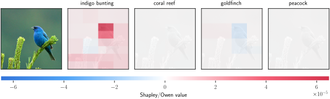
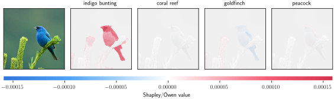

<!-- Logo + Title -->
<p align="center">
  
</p>

<h1 align="center">ShapBPT: Image Feature Attributions using Data-Aware Binary Partition Trees</h1>

<p align="center">
  <b>AAAI-2026 (40th AAAI Conference on Artificial Intelligence), Singapore</b><br>
</p>


      <a href ="https://github.com/rashidrao-pk/shap_bpt_tests/blob/main/LICENSE">
        
      </a> <a href="https://github.com/rashidrao-pk/">

</a> 
      <a href="https://github.com/rashidrao-pk/">
        
      </a>
<a href="https://github.com/rashidrao-pk/shap_bpt_tests/issues?q=is%3Aissue+is%3Aclosed">

</a>
<a href="https://github.com/rashidrao-pk/shap_bpt_tests/issues">

</a>
<a href="https://github.com/rashidrao-pk/shap_bpt_tests/pulls?q=is%3Apr+is%3Aclosed">

</a>
<a href="https://github.com/rashidrao-pk/shap_bpt_tests/pulls">

</a>

<a href="https://github.com/rashidrao-pk/shap_bpt_tests/watchers">

</a>
<a href="https://github.com/rashidrao-pk/shap_bpt_tests/forks">

</a>
<a href="https://github.com/rashidrao-pk/shap_bpt_tests/stargazers">

</a>


## 🎉 ShapBPT Experiments — v1.0 (AAAI-26 Paper Release)

## Availability
ShapBPT Package: 
Technical Appendix: 

- Code — https://github.com/amparore/shap_bpt
- Tests — https://github.com/rashidrao-pk/shap_bpt_tests
- Tech. Appendix — https://zenodo.org/records/17570695

---
## 🔍 Overview

This repository contains the **experiments, notebooks, and precomputed results** for the paper:

> **ShapBPT: Image Feature Attributions using Data-Aware Binary Partition Trees**  
> A novel eXplainable AI (XAI) method for image feature attribution based on data-aware binary partition trees.

This repo provides:

- All **experiments E1–E7** from the paper  
- **Notebooks** for quick and full replication  
- **Precomputed results (PDFs & CSVs)**  
- Ready-to-run ShapBPT usage examples

> **Note:** The actual *ShapBPT library* is hosted separately:  
> https://github.com/amparore/shap_bpt

---

## 📚 Experiments Summary

| Name | Dataset | Model | Task | Model Path / Type | Time |
|:----:|:--------|:------|:------|:-------------------|:------|
| E1 | ImageNet-S50 | ResNet50 | Classification | Pretrained | 7h 50m |
| E2 | ImageNet-S50 | Ideal | Controlled IoU | Pretrained | 4h 9m |
| E3 | ImageNet-S50 | SwinViT | Classification | Pretrained | 20h 6m |
| E4 | MS-COCO | YOLO11s | Object detection | Pretrained - `notebooks/E4_MS_COCO/yolo11s.pt` | 11h 42m |
| E5 | CelebA | CNN | Face attributes | Pretrained - `notebooks/E5_CelebA/models/model.pth` | 6h 14m |
| E6 | MVTec | VAE-GAN | Anomaly Detection | Pretrained - `notebooks/E6_XAD/models/` | 2h 56m |
| E7 | ImageNet-S50 | ViT-Base16 | Classification | Pretrained | 14h 48m |
| E8 | ImageNet-S50 | -- | Human Interpretation | - | - |
---

## ⚙️ 1. Setup
### 1.1 Create environment

```bash
conda create -n env_shapbpt python==3.9.18
conda activate env_shapbpt
pip install -r requirements.txt
conda install pytorch torchvision torchaudio pytorch-cuda=11.8 -c pytorch -c nvidia
```

### 1.2 LaTeX (optional but recommended)
Ubuntu:

```bash
sudo apt-get install texlive-latex-extra texlive-fonts-recommended dvipng cm-super
```

Windows: Install **MikTeX**.

---
### 1.3 Clone tests repo

```bash
git clone https://github.com/rashidrao-pk/shap_bpt_tests
cd shap_bpt_tests
```

### 1.4 Clone main ShapBPT package and install

```bash
git clone https://github.com/amparore/shap_bpt
```
**_Note_**: follow all instructions to install ShapBPT package.

#### Test installation:

```python
import shap_bpt
print(shap_bpt.__version__)
```

---

### 1.5 Required datasets

Download and place into:

```
notebooks/datasets/
```

| Exp | Dataset | Download |
|:---:|:--------|:---------|
| E1/E2/E3/E7 | ImageNet-S50 | https://github.com/LUSSeg/ImageNet-S |
| E4 | MS-COCO 2017 val | https://cocodataset.org/#download |
| E5 | CelebAMask-HQ | https://github.com/switchablenorms/CelebAMask-HQ |
| E6 | MVTec AD | https://www.mvtec.com/company/research/datasets/mvtec-ad |

---

## 🚀 2. Minimal Example (ShapBPT)

```python
import shap_bpt

explainer = shap_bpt.Explainer(
    f_masked,                   # black box model
    image_to_explain, 
    num_explained_classes=4,
    verbose=True
)
MAX_EVALS_BUDGET = 1000
shap_values_bpt = explainer.explain_instance(
    MAX_EVALS_BUDGET,           # budget for explanation
    method="BPT",               # partioning method
    batch_size=4,               # bacth size
    # max_weight=None   
)

shap_values_aa = explainer.explain_instance(
    MAX_EVALS_BUDGET,
    method="AA",
    verbose_plot=False,
    batch_size=4,
    # max_weight=None
)

# shap_bpt.plot_owen_values(
#     explainer,
#     [shap_values_aa, shap_values_bpt],
#     class_names,
#     names=["AxisAligned", "BPT"]
# )

```

```python
# PLOT FEATURE ATTRIBUTION --> AA
shap_bpt.plot_owen_values(explainer, shap_values_aa, class_names)
```


<center></center>

```python
# PLOT FEATURE ATTRIBUTION --> BPT
shap_bpt.plot_owen_values(explainer, shap_values_bpt, class_names)
```
<center></center>


---

## 📊 3. Precomputed Results

| Exp | Dataset | Model | PDF | CSV |
|:---:|:--------|:------|:-----|:-----|
| E1 | ImageNet-S50 | ResNet50 | `PDF/HTML_E1_real_resnet_gray_combined.pdf` | `csv_exp_E1_ImageNet_resnet_real_gray_logits.csv` |
| E2 | ImageNet-S50 | Ideal | `PDF/HTML_E2_ideal_resnet_gray_combined.pdf` | `csv_exp_E2_ImageNet_resnet_ideal_gray_logits.csv` |
| E3 | ImageNet-S50 | SwinViT | `PDF/HTML_E3_real_swin_trans_vit_gray_combined.pdf` | `csv_exp_E3_ImageNet_swin_trans_vit_real_gray_logits.csv` |
| E4 | MS-COCO | YOLO11s | `PDF/HTML_E4_yolo11s_gray_Combined.pdf` | `csv_exp_E4_yolo11s_gray_9.csv` |
| E5 | CelebA | CNN | `PDF/HTML_E5_CelebA_gray_combined.pdf` | `csv_exp_E5_IoU_face_1000_14_gray_brownhairs.csv` |
| E6 | MVTec | VAE-GAN | `PDF/HTML_E6_hazelnut_heatmaps_IoU.pdf` | `csv_exp_E6_testresults_hazelnut_9_BPT_new_eval.csv` |
| E7 | ImageNet-S50 | ViT-Base16 | `PDF/HTML_E7_ViT__combined_100.pdf` | `csv_exp_E7_ImageNet_vit_real_gray_logits.csv` |

---


## 4. Figure-to-Notebook Mapping

### ✅ 4.1 Main Paper

| Paper Figure | What it Shows                           | Notebook Path                                     |
| ------------ | --------------------------------------- | ------------------------------------------------- |
| **Fig. 1**   | Overview + comparison example           | `notebooks/N1_Fig1_and_Fig3.ipynb`                |
| **Fig. 2**   | BPT partitioning visualization          | *Generated from core library demos*               |
| **Fig. 3**   | Qualitative examples (ResNet/Swin/ViT)  | `notebooks/N1_Fig1_and_Fig3.ipynb`                |
| **Fig. 4**   | IoU comparison (AA vs BPT)              | `E1_E2_E3_E7/N1_DrawPlotFig4_Fig6_from_CSV.ipynb` |
| **Fig. 5**   | Quantitative Analysis           | `notebook/N2_summary_plots.ipynb`                    |
---
### ✅ 4.2 Technical Appendix ([available here](https://zenodo.org/records/17570695))
---
| Paper Figure | What it Shows                           | Notebook Path                                     |
| ------------ | --------------------------------------- | ------------------------------------------------- |
| **Fig. 6,Fig. 9,Fig. 10, & Fig. 19**   | Extended heatmaps for Exp E1,E2,E2 & E7                    | `notebook/E1_E2_E3_E7/N1_1_Run_experiments_testing.ipynb` |
| **Fig. 7,Fig.8, Fig.11  & Fig. 20**   | Results on all images for Exp E1,E2,E2 & E7 | `notebook/E1_E2_E3_E7/N2_1_DrawPlot_Fig5_Fig6_Fig7_from_CSV.ipynb`                       |
| **Fig. 12**   | Extended heatmaps for Exp. E4 (Object Detection on MS COCO) | `E4_MS_COCO/N1_MS_COCO_testing.ipynb.ipynb`                       |
| **Fig. 13**   | Results on all images | `E4_MS_COCO/N2_DrawPlot_from_CSV.ipynb`                       |
| **Fig. 14**   | Extended heatmaps for Exp. E5 (Facial Attributes Recongnition on  CelebA dataset) | `E5_CelebA/N1_Run_experiments_CelebA.ipynb`                       |
| **Fig. 15**   | Results for Exp. E5 (Facial Attributes Recongnition on  CelebA dataset) | `E5_CelebA/N2_DrawPlot_from_CSV.ipynb`                       |
| **Fig. 16**   | Framework for Anomaly Detection | using drawing tool                       |
| **Fig. 17**   | Extended heatmaps Anomaly detection explanations (using VAE-GAN on MVTec dataset)  | `E6_XAD/N1_XAD_HAZELNUT.ipynb`                       |
| **Fig. 18**   | Results on all images  | `E6_XAD/N2_DrawPlot_from_CSV.ipynb`                       |
| **Fig. 21**   | Human study — Explanations  | -                   |
| **Fig. 22**   | Human study — ranking of explanations   | `E8_human_study/HumanStudyResults.ipynb`                   |
| **Table 2**   | Annova Analysis   | `notebooks/N2_summary_plots.ipynb`                   |


## 🔁 5. Reproduce Paper Results

### 5.1 Quick (few minutes)

- Run:

```
notebooks/N1_Fig1_and_Fig3.ipynb
```

- For Figures 4 & 6:

```
notebooks/E1_E2_E3_E7/N2_DrawPlotFig4_Fig6_from_CSV.ipynb
```

---

### 5.2 Full replication (long)

Run:

```
notebooks/E1_E2_E3_E7/N1_Run_experiments.ipynb
```

This computes:

- full saliency maps  
- IoU metrics  
- CSV files used in the paper  

Generate HTML visualizations:

```
notebooks/E1_E2_E3_E7/additional_material/N3_Create_HTML_File.ipynb
```

Runtimes (approx):

- E1: 24h  
- E2: 16h  
- E3: 30h  

---

## 🖥️ Hardware Used

| Device | CPU | RAM | GPU |
|:------|:----|:----:|:-----|
| Santech XN2 | Intel i9 13th Gen | 16GB | RTX 4070 |
| MacBook Pro | Apple M1 | 16GB | M1 GPU |

---

## 📁 Repo Structure

```
├── notebooks
│   ├── E1_E2_E3_E7
│   │   ├── N1_Run_experiments.ipynb
│   │   ├── N2_DrawPlotFig4_Fig6_from_CSV.ipynb
│   │   ├── N3_Create_HTML_File.ipynb
│   ├── E4_MS_COCO
│   ├── E5_CelebA
│   ├── E6_XAD
│   └── utils
├── PDF
├── results_logits_with_auc_clipped
├── saved_explanations
└── README.md
```

### Authors ✍️

| Sr. No. | Author Name | Affiliation | Google Scholar | 
| :--:    | :--:        | :--:        | :--:           | 
| 1. | Muhammad Rashid | University of Torino, Computer Science Department, C.so Svizzera 185, 10149 Torino, Italy | [Muhammad Rashid](https://scholar.google.com/citations?user=F5u_Z5MAAAAJ&hl=en) | 
| 2. | Elvio G. Amparore | University of Torino, Computer Science Department, C.so Svizzera 185, 10149 Torino, Italy | [Elvio G. Amparore](https://scholar.google.com/citations?user=Hivlp1kAAAAJ&hl=en&oi=ao) | 
| 3. | Enrico Ferrari | Rulex Innovation Labs, Rulex Inc., Via Felice Romani 9, 16122 Genova, Italy | [Enrico Ferrari](https://scholar.google.com/citations?user=QOflGNIAAAAJ&hl=en&oi=ao) | 
| 4. | Damiano Verda | Rulex Innovation Labs, Rulex Inc., Via Felice Romani 9, 16122 Genova, Italy | [Damiano Verda](https://scholar.google.com/citations?user=t6o9YSsAAAAJ&hl=en&oi=ao) |


---

## 📑 Citation

```
@inproceedings{Rashid2026ShapBPT,
  title={ShapBPT: Image Feature Attributions using Data-Aware Binary Partition Trees},
  author={Muhammad Rashid and Elvio G. Amparore and others},
  booktitle={Proceedings of the AAAI Conference on Artificial Intelligence},
  year={2026}
}
```
### Keywords 🔍
Explainable AI · XAI · Computer Vision · Object Localization

### Copyright Notice:
MIT license
Author: Muhammad Rashid (muhammad.rashid@unito.it)
University of Turin, Italy.

## Funding
This work has received funding from the European Union’s Horizon research and innovation program Chips JU under Grant Agreement No. 101139769, **_DistriMuSe project_** (HORIZON-KDT-JU-2023-2-RIA). The JU receives support from the European Union’s Horizon research and innovation programme and the nations involved in the mentioned projects. The work reflects only the authors’ views; the European Commission is not responsible for any use that maybe made of the information it contains.

## Contributors

<a href="https://github.com/rashidrao-pk/shap_bpt_tests/graphs/contributors">
  
</a>
<br>

> [!NOTE]
> Contributions to improve the completeness of this list are greatly appreciated. If you come across any overlooked papers, please **feel free to [*create pull requests*](https://github.com/rashidrao-pk/shap_bpt_tests/pulls), [*open issues*](https://github.com/rashidrao-pk/shap_bpt_tests/issues) or contact me via [*email*](mailto:muhammad.rashid@unito.it)**. Your participation is crucial to making this repository even better.


