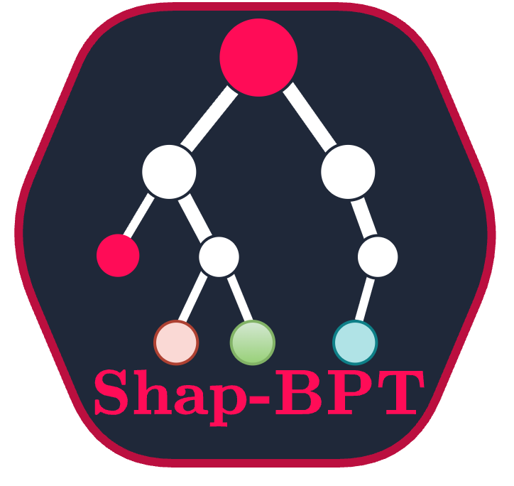

# ShapBPT Tests & Experiments 

<p align="center">
  <h3 align="center">
    Experiments and Reproducibility Repository for<br>
    <i>ShapBPT: Image Feature Attributions using Data-Aware Binary Partition Trees</i>
  </h3>

  <p align="center">
    Accepted at <b>AAAI-2026 — The 40th AAAI Conference on Artificial Intelligence</b><br>
    Singapore 🇸🇬
  </p>
</p>

<p align="center">

<a href="https://arxiv.org/abs/2602.07047"></a>
<a href="https://ojs.aaai.org/index.php/AAAI/article/view/39699"></a>
<a href="https://pypi.org/project/shap-bpt/"></a>
<a href="https://pypi.org/project/shap-bpt/"></a>
<a href="https://github.com/rashidrao-pk/shap_bpt_tests/blob/main/LICENSE"></a>
<a href="https://github.com/rashidrao-pk/shap_bpt_tests/graphs/contributors"></a>
<a href="https://github.com/rashidrao-pk/shap_bpt_tests"></a>
<a href="https://github.com/rashidrao-pk/shap_bpt_tests/commits/main"></a>
<a href="https://github.com/rashidrao-pk/shap_bpt_tests/commits/main"></a>
 
</p>

---

## 📌 Overview

This repository contains the **official experiments, notebooks, visualizations, and reproducibility material** for the AAAI-26 paper:

> **ShapBPT: Image Feature Attributions using Data-Aware Binary Partition Trees**

The repository includes:

- Experiments **E1–E8**
- Reproducible Jupyter notebooks
- Precomputed CSV and PDF results
- Human evaluation study
- Object detection and anomaly detection case studies
- Minimal examples for using ShapBPT in practice

> [!IMPORTANT]
> This repository contains the **experimental framework and results**.
>
> The official ShapBPT Python package is available here:
>
> https://github.com/amparore/shap_bpt

## 📚 New to ShapBPT or Explainable AI?

If you are new to **Explainable AI (XAI)** or want to learn how **ShapBPT** works in detail, including:

- Installation and setup
- Theory behind Shapley and Owen values
- Binary Partition Trees (BPT)
- API usage examples
- Visualization utilities
- Tutorials and notebooks

please read the official documentation:

🔗 https://shapbpt.readthedocs.io/en/latest/#

---

## 📦 Availability

| Resource | Link |
|---|---|
| 📘 AAAI Proceedings | https://ojs.aaai.org/index.php/AAAI/article/view/39699 |
| 📄 arXiv Paper | https://arxiv.org/abs/2602.07047 |
| 🧠 Main ShapBPT Library | https://github.com/amparore/shap_bpt |
| 🧪 Experiments Repository | https://github.com/rashidrao-pk/shap_bpt_tests |
| 📚 Technical Appendix | https://zenodo.org/records/17570695 |
| 📦 PyPI Package | https://pypi.org/project/shap-bpt/ |

Install from PyPI:

```bash
pip install shap-bpt
```

---

## 🎉 ShapBPT Experiments — AAAI-26 Release

This repository supports the paper:

> **ShapBPT: Image Feature Attributions using Data-Aware Binary Partition Trees**  
> Accepted at **AAAI-26, The 40th AAAI Conference on Artificial Intelligence, Singapore**

---

## 🔍 What This Repository Contains

This repository contains all experiments, notebooks, and precomputed results used in the ShapBPT paper, including:

- Experiments **E1–E8**
- Datasets: ImageNet-S50, MS-COCO, CelebA, MVTec AD
- Jupyter notebooks for reproducing main figures
- Precomputed PDFs and CSVs for tables and plots
- Human interpretation study results
- Minimal ShapBPT examples

> [!WARNING]
> This repository does **not** contain the core ShapBPT library.
>
> Core implementation:
>
> https://github.com/amparore/shap_bpt

---

## 📚 Experiments Summary

| Name | Dataset | Model | Task | Model Type / Path | Time |
|:---:|:---|:---|:---|:---|:---|
| E1 | ImageNet-S50 | ResNet50 | Classification | Pretrained | 7h 50m |
| E2 | ImageNet-S50 | Ideal | Controlled IoU | Pretrained | 4h 9m |
| E3 | ImageNet-S50 | SwinViT | Classification | Pretrained | 20h 6m |
| E4 | MS-COCO | YOLO11s | Object Detection | `notebooks/E4_MS_COCO/yolo11s.pt` | 11h 42m |
| E5 | CelebA | CNN | Face Attributes | `notebooks/E5_CelebA/models/model.pth` | 6h 14m |
| E6 | MVTec AD | VAE-GAN | Anomaly Detection | `notebooks/E6_XAD/models/` | 2h 56m |
| E7 | ImageNet-S50 | ViT-Base16 | Classification | Pretrained | 14h 48m |
| E8 | ImageNet-S50 | — | Human Interpretation | — | — |

---

## ⚙️ Setup

### 1. Create Environment

```bash
conda create -n env_shapbpt python==3.9.18
conda activate env_shapbpt
```

Install dependencies:

```bash
pip install -r requirements.txt
```

Install PyTorch with CUDA:

```bash
conda install pytorch torchvision torchaudio pytorch-cuda=11.8 -c pytorch -c nvidia
```

---

### 2. Optional LaTeX Support

Ubuntu:

```bash
sudo apt-get install texlive-latex-extra texlive-fonts-recommended dvipng cm-super
```

Windows:

```text
Install MikTeX
```

---

### 3. Clone This Repository

```bash
git clone https://github.com/rashidrao-pk/shap_bpt_tests
cd shap_bpt_tests
```

---

### 4. Install ShapBPT

Recommended:

```bash
pip install shap-bpt
```

Or install from source:

```bash
git clone https://github.com/amparore/shap_bpt
cd shap_bpt
pip install -e .
```

Test installation:

```python
import shap_bpt
print(shap_bpt.__version__)
```

---

## 📂 Required Datasets

Place datasets under:

```text
notebooks/datasets/
```

| Experiment | Dataset | Download |
|:---:|:---|:---|
| E1/E2/E3/E7 | ImageNet-S50 | https://github.com/LUSSeg/ImageNet-S |
| E4 | MS-COCO 2017 val | https://cocodataset.org/#download |
| E5 | CelebAMask-HQ | https://github.com/switchablenorms/CelebAMask-HQ |
| E6 | MVTec AD | https://www.mvtec.com/company/research/datasets/mvtec-ad |

> [!TIP]
> You do not need all datasets to run the quick demo notebooks. Download only the datasets required for the experiments you want to reproduce.

---

## 🧩 Minimal ShapBPT Example

```python
import shap_bpt

explainer = shap_bpt.Explainer(
    f_masked,              # black-box model f(x ⊙ m)
    image_to_explain,      # H×W×C image as numpy array or tensor
    num_explained_classes=4,
    verbose=True,
)

MAX_EVALS_BUDGET = 1000

shap_values_bpt = explainer.explain_instance(
    MAX_EVALS_BUDGET,
    method="BPT",
    batch_size=4,
)

shap_values_aa = explainer.explain_instance(
    MAX_EVALS_BUDGET,
    method="AA",
    verbose_plot=False,
    batch_size=4,
)

shap_bpt.plot_owen_values(explainer, shap_values_aa, class_names)
shap_bpt.plot_owen_values(explainer, shap_values_bpt, class_names)
```

---

## 📊 Precomputed Results

| Exp | Dataset | Model | PDF | CSV |
|:---:|:---|:---|:---|:---|
| E1 | ImageNet-S50 | ResNet50 | [PDF](/PDF/HTML_E1_real_resnet_gray_combined.pdf) | `csv_exp_E1_ImageNet_resnet_real_gray_logits.csv` |
| E2 | ImageNet-S50 | Ideal | [PDF](/PDF/HTML_E2_ideal_resnet_gray_combined.pdf) | `csv_exp_E2_ImageNet_resnet_ideal_gray_logits.csv` |
| E3 | ImageNet-S50 | SwinViT | [PDF](/PDF/HTML_E3_real_swin_trans_vit_gray_combined.pdf) | `csv_exp_E3_ImageNet_swin_trans_vit_real_gray_logits.csv` |
| E4 | MS-COCO | YOLO11s | [PDF](/PDF/HTML_E4_yolo11s_gray_Combined.pdf) | `csv_exp_E4_yolo11s_gray_9.csv` |
| E5 | CelebA | CNN | [PDF](/PDF/HTML_E5_CelebA_gray_combined.pdf) | `csv_exp_E5_IoU_face_1000_14_gray_brownhairs.csv` |
| E6 | MVTec | VAE-GAN | [PDF](/PDF/HTML_E6_hazelnut_heatmaps_IoU.pdf) | `csv_exp_E6_testresults_hazelnut_9_BPT_new_eval.csv` |
| E7 | ImageNet-S50 | ViT-Base16 | [PDF](/PDF/HTML_E7_ViT__combined_100.pdf) | `csv_exp_E7_ImageNet_vit_real_gray_logits.csv` |

---

## 📑 Figure-to-Notebook Mapping

### Main Paper

| Figure | Description | Notebook |
|:---:|:---|:---|
| Fig. 1 | Overview and comparison example | [`notebooks/N1_Fig1_and_Fig3.ipynb`](/notebooks/N1_Fig1_and_Fig3.ipynb) |
| Fig. 2 | BPT partitioning visualization | Core library demos |
| Fig. 3 | Qualitative examples for ResNet/Swin/ViT | [`notebooks/N1_Fig1_and_Fig3.ipynb`](/notebooks/N1_Fig1_and_Fig3.ipynb) |
| Fig. 4 | IoU comparison between AA and BPT | [`notebooks/E1_E2_E3_E7/N1_DrawPlotFig4_Fig6_from_CSV.ipynb`](/notebooks/E1_E2_E3_E7/N1_DrawPlotFig4_Fig6_from_CSV.ipynb) |
| Fig. 5 | Quantitative analysis | [`notebooks/N2_summary_plots.ipynb`](/notebooks/N2_summary_plots.ipynb) |

---

### Technical Appendix

Technical appendix is available here:

https://zenodo.org/records/17570695

| Figure / Table | Description | Notebook |
|:---:|:---|:---|
| Fig. 6, 9, 10, 19 | Extended heatmaps for E1, E2, E3, and E7 | [`notebooks/E1_E2_E3_E7/N1_1_Run_experiments_testing.ipynb`](/notebooks/E1_E2_E3_E7/N1_1_Run_experiments_testing.ipynb) |
| Fig. 7, 8, 11, 20 | Results on all images for E1, E2, E3, and E7 | [`notebooks/E1_E2_E3_E7/N2_1_DrawPlot_Fig5_Fig6_Fig7_from_CSV.ipynb`](/notebooks/E1_E2_E3_E7/N2_1_DrawPlot_Fig5_Fig6_Fig7_from_CSV.ipynb) |
| Fig. 12 | Extended heatmaps for E4, object detection on MS-COCO | [`notebooks/E4_MS_COCO/N1_MS_COCO_testing.ipynb`](/notebooks/E4_MS_COCO/N1_MS_COCO_testing.ipynb) |
| Fig. 13 | Results on all MS-COCO images | [`notebooks/E4_MS_COCO/N2_DrawPlot_from_CSV.ipynb`](/notebooks/E4_MS_COCO/N2_DrawPlot_from_CSV.ipynb) |
| Fig. 14 | Extended heatmaps for E5, facial attribute recognition on CelebA | [`notebooks/E5_CelebA/N1_Run_experiments_CelebA.ipynb`](/notebooks/E5_CelebA/N1_Run_experiments_CelebA.ipynb) |
| Fig. 15 | Results for E5, facial attribute recognition on CelebA | [`notebooks/E5_CelebA/N2_DrawPlot_from_CSV.ipynb`](/notebooks/E5_CelebA/N2_DrawPlot_from_CSV.ipynb) |
| Fig. 16 | Framework for anomaly detection | Drawing tool |
| Fig. 17 | Extended heatmaps for anomaly detection using VAE-GAN on MVTec AD | [`notebooks/E6_XAD/N1_XAD_HAZELNUT.ipynb`](/notebooks/E6_XAD/N1_XAD_HAZELNUT.ipynb) |
| Fig. 18 | Results on all anomaly detection images | [`notebooks/E6_XAD/N2_DrawPlot_from_CSV.ipynb`](/notebooks/E6_XAD/N2_DrawPlot_from_CSV.ipynb) |
| Fig. 21 | Human study explanations | — |
| Fig. 22 | Human study ranking of explanations | [`notebooks/E8_human_study/HumanStudyResults.ipynb`](/notebooks/E8_human_study/HumanStudyResults.ipynb) |
| Fig. 23 | Convergence test results | [`notebooks/E1_E2_E3_E7/N2_2_DrawPlot_Fig5_Fig6_Fig7_from_CSV.ipynb`](/notebooks/E1_E2_E3_E7/N2_2_DrawPlot_Fig5_Fig6_Fig7_from_CSV.ipynb) |
| Table 2 | ANOVA analysis | [`notebooks/N2_summary_plots.ipynb`](/notebooks/N2_summary_plots.ipynb) |

---

## 🔁 Reproduce Paper Results

### Quick Reproduction

Run:

```text
notebooks/N1_Fig1_and_Fig3.ipynb
```

For main quantitative figures:

```text
notebooks/E1_E2_E3_E7/N1_DrawPlotFig4_Fig6_from_CSV.ipynb
```

---

### Full Replication

Run:

```text
notebooks/E1_E2_E3_E7/N1_Run_experiments.ipynb
```

This computes:

- full saliency maps
- IoU metrics
- CSV files used in the paper

Generate HTML visualizations:

```text
notebooks/E1_E2_E3_E7/additional_material/N3_Create_HTML_File.ipynb
```

Approximate runtimes:

| Experiment | Runtime |
|:---:|:---:|
| E1 | 24h |
| E2 | 16h |
| E3 | 30h |

---

## 🖥️ Hardware Used

| Device | CPU | RAM | GPU |
|:---|:---|:---:|:---|
| Santech XN2 | Intel i9 13th Gen | 16 GB | RTX 4070 |
| MacBook Pro | Apple M1 | 16 GB | M1 GPU |

---

## 📁 Repository Structure

```text
├── notebooks
│   ├── E1_E2_E3_E7
│   │   ├── N1_Run_experiments.ipynb
│   │   ├── N2_DrawPlotFig4_Fig6_from_CSV.ipynb
│   │   └── N3_Create_HTML_File.ipynb
│   ├── E4_MS_COCO
│   ├── E5_CelebA
│   ├── E6_XAD
│   └── utils
├── PDF
├── results_logits_with_auc_clipped
├── saved_explanations
└── README.md
```

---

## 🔍 Keywords

Explainable AI · XAI · Computer Vision · Feature Attribution · Shapley Values · Owen Values · Binary Partition Trees · Object Localization · Anomaly Detection

---

## 🙏 Acknowledgments

We gratefully acknowledge the contributions and resources that supported this work.

### Funding

This work received funding from the European Union’s Horizon research and innovation programme **Chips JU** under Grant Agreement No. **101139769**, as part of the [DistriMuSe Project](https://distrimuse.eu/) — HORIZON-KDT-JU-2023-2-RIA.

The Joint Undertaking receives support from the European Union and the participating member states.

### Models and Pretrained Weights

We thank the developers of the model architectures and pretrained weights used in our experiments:

- [Swin Transformer, Microsoft](https://github.com/microsoft/Swin-Transformer)
- [Vision Transformer, PyTorch](https://docs.pytorch.org/vision/stable/models/generated/torchvision.models.vit_b_16.html)
- [Facial Attribute CNN by Kartik Batra](https://www.kaggle.com/code/kartikbatra/multilabelclassification/notebook)
- [VAE-GAN model and weights](https://github.com/rashidrao-pk/anomaly_detection_trust_case_study)
- [YOLO Models by Ultralytics](https://docs.ultralytics.com/models/yolov11/)

### Datasets

We acknowledge the dataset curators whose work made this project possible:

- [ImageNet](https://www.image-net.org)
- [ImageNet-S50](https://github.com/LUSSeg/ImageNet-S)
- [CelebA-HQ](https://github.com/switchablenorms/CelebAMask-HQ)
- [MVTec AD](https://www.mvtec.com/company/research/datasets/mvtec-ad)
- [MS-COCO](https://cocodataset.org)

### Related Work Inspiration

Some notebook design ideas were inspired by the excellent documentation and examples in Shap-IQ:

https://shapiq.readthedocs.io/en/latest/index.html


---

## 🤝 Contributing

> [!NOTE]
> Contributions to improve this repository are welcome.
>
> If you find missing files, overlooked related work, broken links, or reproducibility issues, please:
>
> - [Open an issue](https://github.com/rashidrao-pk/shap_bpt_tests/issues)
> - [Create a pull request](https://github.com/rashidrao-pk/shap_bpt_tests/pulls)
> - Contact me via [email](mailto:muhammad.rashid@unito.it)

---

## 📖 Citation

If you use this repository or the ShapBPT method, please cite:

```bibtex
@inproceedings{rashid2026shapbpt,
  title={{ShapBPT: Image Feature Attributions Using Data-Aware Binary Partition Trees}},
  author={Rashid, Muhammad and Amparore, Elvio G and Ferrari, Enrico and Verda, Damiano},
  booktitle={Proceedings of the AAAI Conference on Artificial Intelligence},
  volume={40},
  number={30},
  pages={25099--25107},
  year={2026},
  url={https://doi.org/10.1609/aaai.v40i30.39699}
}
```