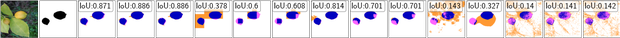

# ShapBPT: Image Feature Attributions using Data-Aware Binary Partition Trees  
### Supplementary Material – ImageNet-S50 & MS-COCO Experiments

This repository serves as **supplementary material** for the paper:

> **_ShapBPT: Image Feature Attributions using Data-Aware Binary Partition Trees_**

It provides complete experimental resources, including:
- Ready-to-run Jupyter notebooks  
- Precomputed CSV files (AUC, IoU, MSE, etc.)  
- Saliency heatmaps and visual comparisons  
- Examples across ResNet50, Ideal Linear models, SwinViT, and YOLO11s  
- Ground-truth–based evaluation (IoU, Max-IoU)  

The goal is to allow **full reproducibility** of the ShapBPT experiments across classification and object detection tasks.

---

# 📚 Experiment Details

The following experiments are included:

| Name | Dataset | Model | Task | Model Path / Type | Time |
|:----:|:--------|:------|:------|:-------------------|:------|
| **E1** | ImageNet-S50 | ResNet-50 | Classification | Pretrained | 7h 50m |
| **E2** | ImageNet-S50 | Ideal (Linear) | Controlled IoU | Pretrained | 4h 9m |
| **E3** | ImageNet-S50 | SwinViT | Classification | Pretrained | 20h 6m |
| **E4** | MS-COCO | YOLO11s | Object Detection | Pretrained (`notebooks/E4_MS_COCO/yolo11s.pt`) | 11h 42m |

Each experiment includes:
- Model predictions  
- ShapBPT saliency heatmaps  
- Baseline XAI comparisons (AA, LIME, LRP, GradCAM, IDG, GradExp, GradShap)  
- Ground-truth IoU visualizations  
- Reconstruction-based metrics  

---

# 🔍 Single Example (Comparison of XAI Methods)

The table below shows **all saliency methods** for a sample ImageNet-S50 example:  
**Image:** `ILSVRC2012_val_00003843`  
**Model:** ResNet-50  
**Background Replacement:** Gray

    <table>
    <tr>
        <td style="text-align: center;"> Input</td>
        <td style="text-align: center;"> GT</td>
        <td style="text-align: center;"> BPT-100</td>
        <td style="text-align: center;"> BPT-500</td>
        <td style="text-align: center;"> BPT-1000</td>
        <td style="text-align: center;"> AA-100</td>
        <td style="text-align: center;"> AA-500</td>
        <td style="text-align: center;"> AA-1000</td>
        <td style="text-align: center;"> LIME-50</td>
        <td style="text-align: center;"> LIME-100</td>
        <td style="text-align: center;"> LIME-200</td>
        <td style="text-align: center;"> LRP</td>
        <td style="text-align: center;"> GradCAM</td>
        <td style="text-align: center;"> IDG</td>
        <td style="text-align: center;"> GradExp</td>
        <td style="text-align: center;"> GradShap</td>
    </tr>
    <tr>
        <td colspan=16>
        
        </td>
    </tr>
    <tr>
        <td colspan=16 style="text-align: center;">
        Combined heatmap comparison for image 00003843 using ResNet-50 with gray background replacement.
        </td>
    </tr>
    <tr>
        <td colspan=16>
        
    </tr>
    <tr>
        <td colspan=16 style="text-align: center;">
        Ground-truth IoU visualization for image 00003843 (per-method evaluation).
        </td>
    </tr>
    </table>

---

# 📌 Notes on Evaluation

- **BPT-K** and **AA-K** indicate K-SHAP sample budgets for partition-based Shapley value estimation.  
- **LIME-K** corresponds to K superpixel perturbations.  
- **LRP**, **GradCAM**, **IDG**, **GradExp**, and **GradShap** represent standard gradient-based and rule-based XAI methods.  
- IoU plots indicate how well saliency maps align with ground-truth object regions.  
 
