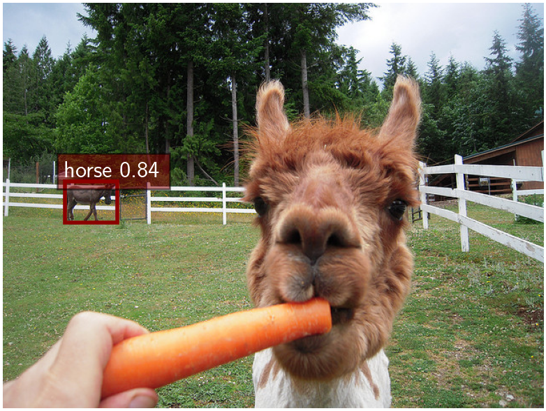
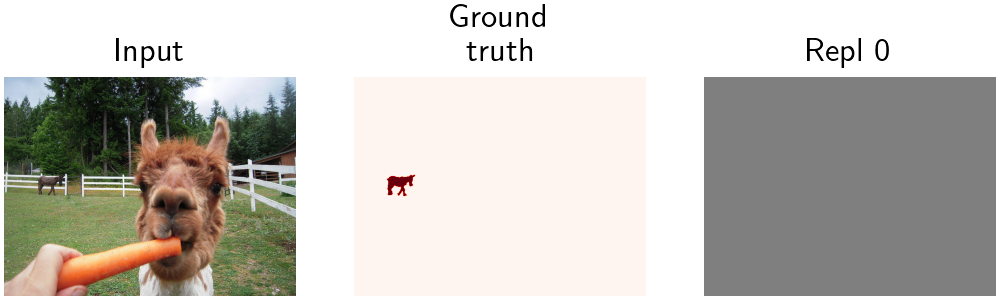
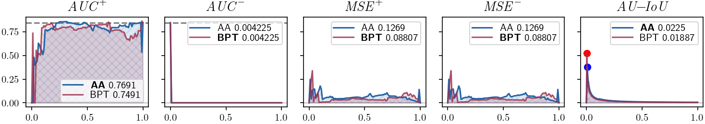
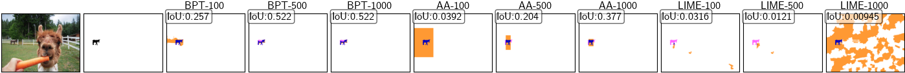

# ShapBPT: Image Feature Attributions using Data-Aware Binary Partition Trees  
### Supplementary Material – MS-COCO Object Detection Experiments (YOLO11s)

This folder provides the **complete supplementary material** for the MS-COCO experiment conducted in the paper:

> **_ShapBPT: Image Feature Attributions using Data-Aware Binary Partition Trees_**

The goal of this experiment is to evaluate **ShapBPT** as an eXplainable AI (**XAI**) method for **object detection**, using the **YOLO11s** model on the **MS-COCO 2017 validation set**.  
All notebooks, CSV files, precomputed heatmaps, ground-truth IoU comparisons, and plots are included here for reproducibility.

---

# 📁 Folder Overview

This directory contains the following components:

### **Folders**
- **[`CSV/`](CSV/)**  
  Contains the **precomputed CSV files** generated by running  
  **`N1_MS_COCO.ipynb`**.  
  These CSV files store:
  - AUC curves  
  - MSE curves  
  - IoU scores  
  - Pixel-mask evaluation metrics  
  - Per-image saliency statistics  

- **[`results/`](results/)**  
  Contains:
  - All **heatmaps** generated using ShapBPT and baseline methods  
  - Per-image **IoU visualizations**  
  - **Prediction overlays** (YOLO11s bounding boxes)  
  - **Saliency → metric plots** (AUC/MSE vs. mask percentage)

---

# 📄 Notebook

## **1. `N1_MS_COCO.ipynb`**
This is the **main notebook** for running the complete MS-COCO experiment.  
It includes:

- Loading and preprocessing MS-COCO validation images  
- Running **YOLO11s** on each image  
- Applying **ShapBPT** and baseline XAI methods  
- Visualizing:
  - saliency heatmaps  
  - prediction overlays  
  - groundtruth masks  
- Computing evaluation metrics:
  - AUC curves  
  - MSE curves  
  - IoU  
  - Max-IoU comparison  
- Saving results into structured folders  
- Optionally running **full-dataset evaluation** and saving outputs under `results/`

---

# 🔍 Example Outputs

Below are example visualizations for COCO image **113235**, using YOLO11s and gray background replacement.

---

## 🟥 Model Predictions

<center>

</center>

<p align="center"><i>Top-k predicted objects on MS-COCO image 113235 (YOLO11s).</i></p>

---

## 🟥 Ground-Truth Segmentation

<center>

</center>

<p align="center"><i>Ground-truth objects from MS-COCO annotations, visualized on a gray background.</i></p>

---

## 🟦 Saliency Map (ShapBPT)

<center>

</center>

<p align="center"><i>ShapBPT heatmap for image 113235 (gray background replacement, YOLO11s).</i></p>

---

## 📈 Evaluation Metrics (AUC / MSE)

<center>

</center>

<p align="center"><i>AUC and MSE curves measuring importance fidelity across masking percentages.</i></p>

---

## 🟩 IoU Evaluation (Ground-Truth Comparison)

<center>

</center>

<p align="center"><i>IoU computed between saliency regions and true object masks.</i></p>

---

## 🟩 Max-IoU Evaluation

<center>

</center>

<p align="center"><i>Max-IoU analysis showing the best-matching region-wise overlap for evaluation.</i></p>

---

# 📦 Full Test Evaluation

The final section of the notebook (`N1_MS_COCO.ipynb`) enables **full validation-set evaluation**:

### ✔ Runs ShapBPT for each MS-COCO image  
### ✔ Computes and stores:
- Heatmaps  
- IoU maps  
- Prediction overlays  
- AUC/MSE curves  
- CSV summaries  

### ✔ Results are saved automatically into:
```
results/yolo11s_gray/
CSV/
```

This allows complete replication of the MS-COCO results reported in the ShapBPT paper.

