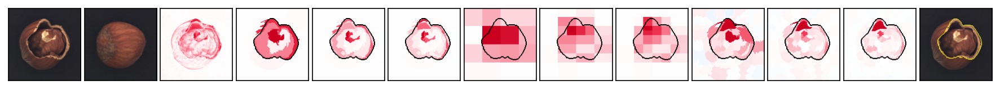
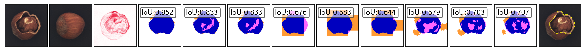

# Shapley image explanations with data-aware Binary Partition Trees

## Experiments on Anomaly Detection E6
eXplainable Anomaly Detection (XAD) experiments presented as `Experiments E6`.

## Dependencies and Installation 🔧
- Python 3.9.18
- Tensorflow
- Option: NVIDIA GPU + CUDA

Clone the repositry and install all the required libraries by running following lines:

```
conda create -n ad python==3.9.18
pip install -r requirements.txt
```

## Dataset:
To explain the true driver behind image anomaly detection system, MVTec dataset ise used and can be found at official link of [here at MVTec](https://www.mvtec.com/company/research/datasets/mvtec-ad).
To replicate the results presented in suplementry material, MVTec dataset needs to be downloaded at `notebooks\dataset\MVTec`
## Model setup :
 - A `VAE-GAN model` is trained on $30000$ epochs which is uploaded at [`THIS ANONYMOUS LINK/E6_XAD/models`](https://anonymous.4open.science/r/shapbpt_experiments) and make sure to download it and place it into the [`models/`](/notebooks/E6_XAD/models/) folder which is used as $BlackBox-model$.
 - **NOTE** `hazelnut_VAE_GAN_30000` folder should contain 11 files.
    - hazelnut_VAE_GAN_30000.csv
    - hazelnut_VAE_GAN_30000_decoder.data-00000-of-00001
    - hazelnut_VAE_GAN_30000_decoder.index
    - hazelnut_VAE_GAN_30000_discriminator.data-00000-of-00001
    - hazelnut_VAE_GAN_30000_discriminator.index
    - hazelnut_VAE_GAN_30000_encoder.data-00000-of-00001
    - hazelnut_VAE_GAN_30000_encoder.index
    - hazelnut_VAE_GAN_30000_model.data-00000-of-00001
    - hazelnut_VAE_GAN_30000_model.index
    - hazelnut_VAE_GAN_30000_vae.data-00000-of-00001
    - hazelnut_VAE_GAN_30000_vae.index
    

 - Model can be trained again using more number of epochs for further refinement.

## Structure:

## Folder Structure

1. Main folder `XAD` contains notebooks and results folder.

2. Results folder contains further following folders:
    - Folders:
        - csv: folder contains [csv files](results/csv/) which are computed by Notebook: [`N1_XAD_HAZELNUT`](`N1_XAD_HAZELNUT`).
        - boxplots :   this folder contains pre-computed results presented in paper.
    - Files: HTML-Files reporting visual analysis of computed explanations by various XAI methods.

## Notebooks & functions
- [`models.py`](notebooks/XAD/main/models.py) contains the codes for VAE-GAN $model$ used to train and test the trained model.
- [`utils.py`](notebooks/XAD/utils.py) contains all the functions required to run [`N1_XAD_HAZELNUT.ipynb`](notebooks/XAD/N1_XAD_HAZELNUT.ipynb) notebook.
- Subfigures presented in `Figure 11` can be produced using saved using hyperparameter `plot_selected_results` as `True` in `Cell#51` and it will use `Cell#53`, and `Cell#54` to save the subfigures at `results\hazelnut\paper_figure` which were togathered to produce `Figure 11`.
- Full test can be run by using boolean parameter `run_full_set` in `Cell#55` which will use `Cell#56` and will save computed explanations in [test_results](results/test_results/) and [CSV file](results/csv/testresults_hazelnut_30000_9_BPT.csv).

- `Boxplots` from `Figure 12` can be produced using [`N2_DrawPlot_from_CSV.ipynb`](N2_DrawPlot_from_CSV.ipynb) notebook and either a [`precomputed csv file`](precomputed_csv/testresults_hazelnut_30000_9_BPT.csv) or by computing [`CSV`](results/hazelnut/testresults_hazelnut_30000_9_BPT.csv) again computed by [`N1_XAD_HAZELNUT.ipynb`](notebooks/XAD/N1_XAD_HAZELNUT.ipynb) notebook.
- All heatmaps and IoU figures can be generted by running [`N3_Create_HTMLs`](N3_Create_HTMLs.ipynb) which loads the both type images saved at `results/hazelnut/test_results`.
- Two HTMLs presenting all visual results are saved as [`HTML_Heatmaps`](results/imgs_hazelnut_heatmaps.html) and [`HTML_IoU`](results/imgs_hazelnut_heatmaps.html).

## Example:

<table>
    <tr>
        <th>Input</th>
        <th>Recons</th>
        <th>Anomaly Map</th>
        <th>BPT-100</th>
        <th>BPT-500</th>
        <th>BPT-1000</th>
        <th>AA-100</th>
        <th>AA-500</th>
        <th>AA-1000</th>
        <th>LIME-250</th>
        <th>LIME-500</th>
        <th>LIME-1000</th>
        <th>GroundTruth</th>
    </tr>
    <tr>
        <td colspan="14" style="text-align: center;">
            
            
            
            
        </td>
    </tr>
</table>
